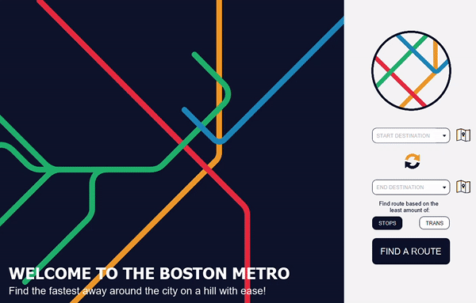

<h2> Boston Metro System :metro: | CS308: Building Software Systems</h2>

The aim of this exercise is to design and implement a multi-graph ADT and to use the multi-graph to model the Boston Metro System in a program that is able to provide directions to passengers on how to get from one station to another.  
 
The application features are:
<ul>
<li>Drop-down that allows direct keyboard input</li>
<li>Station selection through map</li>
<li>Line visualization of route</li>
<li>Map visualization of route</li>
<li>Choice of path with the least amount of stops or transitions</li>
<li>Button to switch start/dest stations</li>
</uk>

 
The system follows a decoupled Model-View-Controller software architecture. To to achieve a fully decoupled multi-graph, our graph implementation uses generics to represent graph edges and nodes.  
We used JavaFX and scenebuilder to develop GUI, JUnit framework for tests and AdobeXd for designs.

<h2>Visuals</h2>

Using map selector to selects station and finding path based on the least amount of stops and transitions.

Using drop-down to selects station. The drop-down is not displayed on the gif.

